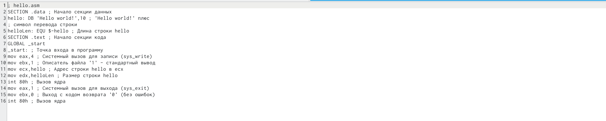
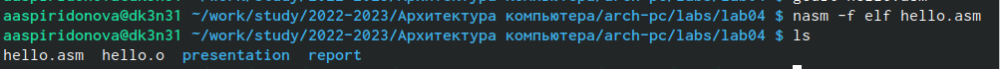
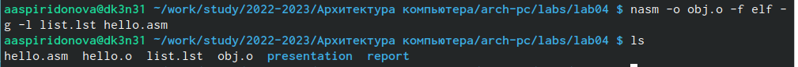
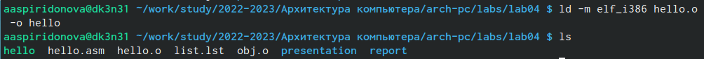
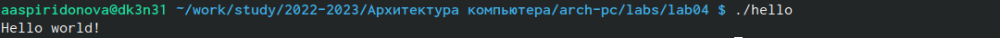
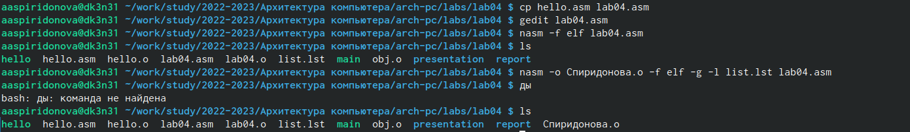
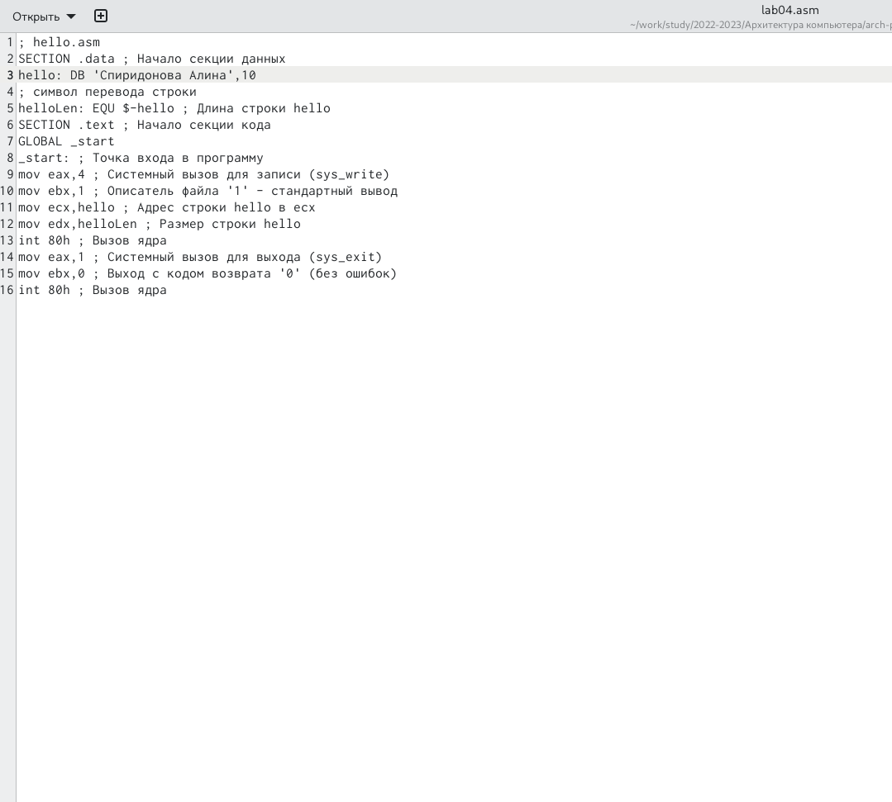
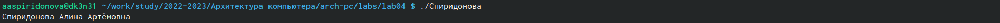

---
## Front matter
title: "Отчёт по лабораторной работе №4"
subtitle: "Дисциплина:Архитектура компьютера"
author: "студентка 1 курса Спиридонова Алина Артёмовна"

## Generic otions
lang: ru-RU
toc-title: "Содержание"

## Bibliography
bibliography: bib/cite.bib
csl: pandoc/csl/gost-r-7-0-5-2008-numeric.csl

## Pdf output format
toc: true # Table of contents
toc-depth: 2
lof: true # List of figures
lot: true # List of tables
fontsize: 12pt
linestretch: 1.5
papersize: a4
documentclass: scrreprt
## I18n polyglossia
polyglossia-lang:
  name: russian
  options:
	- spelling=modern
	- babelshorthands=true
polyglossia-otherlangs:
  name: english
## I18n babel
babel-lang: russian
babel-otherlangs: english
## Fonts
mainfont: PT Serif
romanfont: PT Serif
sansfont: PT Sans
monofont: PT Mono
mainfontoptions: Ligatures=TeX
romanfontoptions: Ligatures=TeX
sansfontoptions: Ligatures=TeX,Scale=MatchLowercase
monofontoptions: Scale=MatchLowercase,Scale=0.9
## Biblatex
biblatex: true
biblio-style: "gost-numeric"
biblatexoptions:
  - parentracker=true
  - backend=biber
  - hyperref=auto
  - language=auto
  - autolang=other*
  - citestyle=gost-numeric
## Pandoc-crossref LaTeX customization
figureTitle: "Рис."
tableTitle: "Таблица"
listingTitle: "Листинг"
lofTitle: "Список иллюстраций"
lotTitle: "Список таблиц"
lolTitle: "Листинги"
## Misc options
indent: true
header-includes:
  - \usepackage{indentfirst}
  - \usepackage{float} # keep figures where there are in the text
  - \floatplacement{figure}{H} # keep figures where there are in the text
---

# Цель работы

Освоение процедуры компиляции и сборки программ, написанных на ассем-
блере NASM.

# Задание

1. В каталоге ~/work/arch-pc/lab05 с помощью команды cp создайте копию
файла hello.asm с именем lab5.asm
2. С помощью любого текстового редактора внесите изменения в текст про-
граммы в файле lab5.asm так, чтобы вместо Hello world! на экран выво-
дилась строка с вашими фамилией и именем.
3. Оттранслируйте полученный текст программы lab5.asm в объектный
файл. Выполните компоновку объектного файла и запустите получивший-
ся исполняемый файл.
4. Скопируйте файлы hello.asm и lab5.asm в Ваш локальный репозиторий
в каталог ~/work/study/2022-2023/"Архитектура компьютера"/arch-
pc/labs/lab05/. Загрузите файлы на Github.

# Теоретическое введение

NASM — это открытый проект ассемблера, версии которого доступны под
различные операционные системы и который позволяет получать объектные
файлы для этих систем. В NASM используется Intel-синтаксис и поддерживаются
инструкции x86-64.
Типичный формат записи команд NASM имеет вид:
[метка:] мнемокод [операнд {, операнд}] [; комментарий]
Здесь мнемокод — непосредственно мнемоника инструкции процессору, ко-
торая является обязательной частью команды. Операндами могут быть числа,
данные, адреса регистров или адреса оперативной памяти. Метка — это иденти-
фикатор, с которым ассемблер ассоциирует некоторое число, чаще всего адрес в
памяти. Т.о. метка перед командой связана с адресом данной команды.
Допустимыми символами в метках являются буквы, цифры, а также следую-
щие символы: _, $, #, @,~,. и ?.
Начинаться метка или идентификатор могут с буквы, ., _ и ?. Перед иденти-
фикаторами, которые пишутся как зарезервированные слова, нужно писать $,
чтобы компилятор трактовал его верно (так называемое экранирование). Макси-
мальная длина идентификатора 4095 символов.
Программа на языке ассемблера также может содержать директивы — ин-
струкции, не переводящиеся непосредственно в машинные команды, а управ-
ляющие работой транслятора. Например, директивы используются для опреде-
ления данных (констант и переменных) и обычно пишутся большими буквами.

В процессе создания ассемблерной программы можно выделить четыре шага:
• Набор текста программы в текстовом редакторе и сохранение её в от-
дельном файле. Каждый файл имеет свой тип (или расширение), который
определяет назначение файла. Файлы с исходным текстом программ на
языке ассемблера имеют тип asm.
• Трансляция — преобразование с помощью транслятора, например nasm,
текста программы в машинный код, называемый объектным. На данном
этапе также может быть получен листинг программы, содержащий кроме
текста программы различную дополнительную информацию, созданную
транслятором. Тип объектного файла — o, файла листинга — lst.
• Компоновка или линковка — этап обработки объектного кода компонов-
щиком (ld), который принимает на вход объектные файлы и собирает по
ним исполняемый файл. Исполняемый файл обычно не имеет расшире-
ния. Кроме того, можно получить файл карты загрузки программы в ОЗУ,
имеющий расширение map.
И запуск программы. Конечной целью является работоспособный испол-
няемый файл. Ошибки на предыдущих этапах могут привести к некор-
ректной работе программы, поэтому может присутствовать этап отладки
программы при помощи специальной программы — отладчика. При на-
хождении ошибки необходимо провести коррекцию программы, начиная
с первого шага.
Из-за специфики программирования, а также по традиции для создания про-
грамм на языке ассемблера обычно пользуются утилитами командной строки
(хотя поддержка ассемблера есть в некоторых универсальных интегрированных
средах).

# Выполнение лабораторной работы

Описываются проведённые действия, в качестве иллюстрации даётся ссылка на иллюстрацию (рис. [-@fig:001])

{ #fig:001 width=70% }
1. Перейдите в каталог, созданный для работы с программами на языке ассемблера NASM.
{ #fig:002 width=90% }
2. Создайте текстовый файл с именем hello.asm и откройте этот файл с помощью любого текстового редактора, например, gedit.Затем введите в него текст из методички:
{ #fig:003 width=90% }
{ #fig:004 width=90% }
{ #fig:005 width=90% }
3. Для компиляции приведённого выше текста программы «Hello World» введите nasm -f elf hello.asm. С помощью команды ls проверьте, что объектный файл был создан.
{ #fig:006 width=90% }
4. Выполните следующую команду: nasm -o obj.o -f elf -g -l list.lst hello.asm 
С помощью команды ls проверьте, что файлы были созданы.
{ #fig:007 width=90% }
5. Объектный файл необходимо передать на обработку компоновщику:
ld -m elf_i386 hello.o -o hello
С помощью команды ls проверьте, что исполняемый файл hello был создан.
{ #fig:008 width=90% }

6. Запустить на выполнение созданный исполняемый файл, находящийся в
текущем каталоге, можно, набрав в командной строке: ./hello
{ #fig:009 width=90% }
7. В каталоге ~/work/arch-pc/lab04 с помощью команды cp создайте копию файла hello.asm с именем lab4.asm
{ #fig:010 width=90% }
8. С помощью любого текстового редактора внесите изменения в текст программы в файле lab4.asm так, чтобы вместо Hello world! на экран выводилась строка с вашими фамилией и именем.
{ #fig:011 width=90% }
9. Оттранслируйте полученный текст программы lab4.asm в объектный файл. Выполните компоновку объектного файла и запустите получившийся исполняемый файл.
{ #fig:012 width=90% }
# Выводы

В ходе выполнения лабораторной работы я освоила процедуры компиляции и сборки программ, написанных на ассемблере NASM.

# Список литературы{.unnumbered}

::: {#refs}
:::
